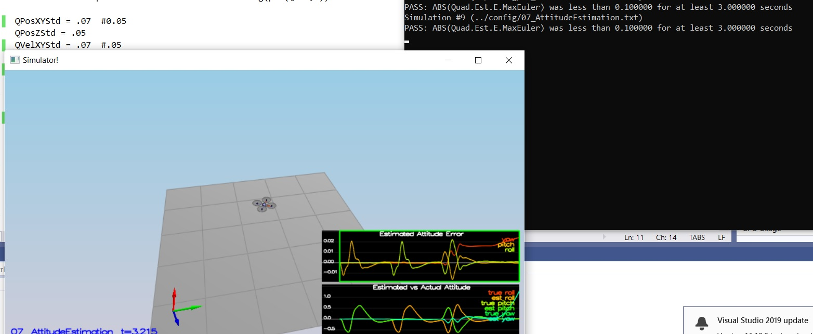
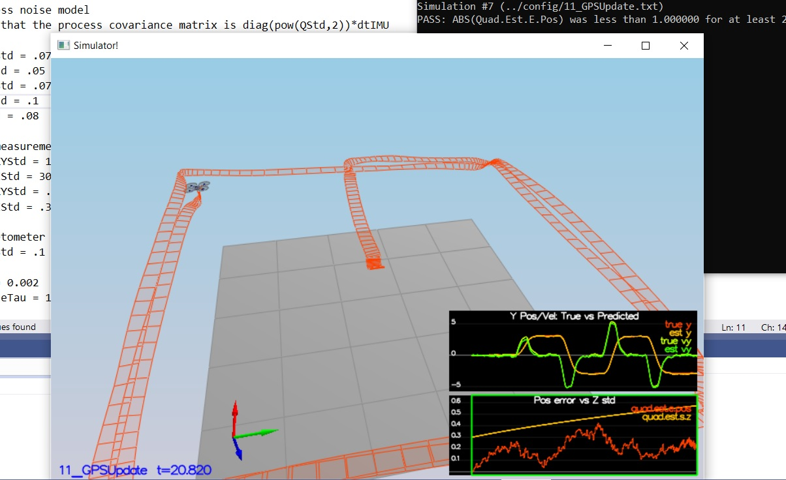

# Autonomous Flight Engineer - 3D Quadrotor Estimation Project #

In this project, I have implemented a 3D Quadrotor Estimator using Extended Kalman Filter technique. The drone is controlled with no noise in 3D Quadrotor Controller that I implemented in my last project. But the reality is we need to estimate current position of drone, velocity and yaw. All the maths used in the project can be found in the paper [Estimation for Quadrotors](https://www.overleaf.com/project/5c34caab7ecefc04087273b9).

[Detailed Project Explantion Page from Udacity](https://github.com/udacity/FCND-Estimation-CPP).

## Setup ##

This project will continue to use the C++ development environment you set up in the Controls C++ project.

 1. Clone the repository
 ```
 git clone https://github.com/udacity/FCND-Estimation-CPP.git
 ```

 2. Import the code into your IDE like done in the [Controls C++ project](https://github.com/udacity/FCND-Controls-CPP#development-environment-setup)
 
 3. You should now be able to compile and run the estimation simulator just as you did in the controls project

## Project Structure ##

Most of the code provided is the drone simulator. The following files where are the the main files need to complete:

* [/src/QuadEstimatorEKF.cpp](./src/QuadEstimatorEKF.cpp): The Extended Kalman Filter for state estimation is implemented in this file.
* [/src/QuadControl.cpp](./src/QuadControl.cpp): The cascade PID control implemented in this file. This is implemented on the previous project, Control of a 3D Quadrotor.
* [/config/QuadEstimatorEKF.txt](./config/QuadEstimatorEKF.txt): Parameters for tuning the EKF are in this parameter file.
* [/config/QuadControlParams.txt](./config/QuadControlParams.txt): Parameters for the PID control code is in QuadControlParams.txt


## The Tasks ##

I builded up the estimator in multiple steps. At each step, there were a set of success criteria that were displayed both in the plots and in the terminal output.

Project outline:

 - [Step 1: Sensor Noise](#step-1-sensor-noise)
 - [Step 2: Attitude Estimation](#step-2-attitude-estimation)
 - [Step 3: Prediction Step](#step-3-prediction-step)
 - [Step 4: Magnetometer Update](#step-4-magnetometer-update)
 - [Step 5: Closed Loop + GPS Update](#step-5-closed-loop--gps-update)
 - [Step 6: Adding Your Controller](#step-6-adding-your-controller)


### Step 1: Sensor Noise ###

For the controls project, the simulator was working with a perfect set of sensors, meaning none of the sensors had any noise.  The first step to adding additional realism to the problem, and developing an estimator, is adding noise to the quad's sensors.

1. In this step, I collected some simulated noisy sensor data and estimated the standard deviation of the quad's sensor. I ran scenario 06_NoisySensors collected some simulated noisy sensor data. The collected data were saved in following csv files with headers: `config/log/Graph1.txt` (GPS X data) and `config/log/Graph2.txt` (Accelerometer X data).

2. Then I processed the logged files to figure out the standard deviation of the the GPS X signal and the IMU Accelerometer X signal.

4. Finally plugged in my derived data into the top of `config/6_Sensornoise.txt`.  Specially, set the values for `MeasuredStdDev_GPSPosXY` and `MeasuredStdDev_AccelXY`.

MeasuredStdDev_GPSPosXY = 0.703
MeasuredStdDev_AccelXY = 0.506

***Success criteria:*** *The standard deviations should accurately capture the value of approximately 68% of the respective measurements.*

Here is an image of the Sensor Noise output:


### Step 2: Attitude Estimation ###

Next is the state estimation which included information from the IMU.  In this step, I improved the complementary filter-type attitude filter with a better rate gyro attitude integration scheme.

1. Run scenario `07_AttitudeEstimation`.  For this simulation, the only sensor used is the IMU and noise levels are set to 0 (see `config/07_AttitudeEstimation.txt` for all the settings for this simulation).  There are two plots visible in this simulation.
   - The top graph is showing errors in each of the estimated Euler angles.
   - The bottom shows the true Euler angles and the estimates.
Observe that there’s quite a bit of error in attitude estimation.

2. In `QuadEstimatorEKF.cpp`, I updated method `UpdateFromIMU()` that contains a complementary filter-type attitude filter.  To reduce the errors in the estimated attitude (Euler Angles), I have implemented a better rate gyro attitude integration scheme. After this implementation, I was able to reduce the attitude errors to get within 0.1 rad for each of the Euler angles.

***Success criteria:*** *The attitude estimator needs to get within 0.1 rad for each of the Euler angles for at least 3 seconds.*

Here is an image of the Attitude Estimation output:




### Step 3: Prediction Step ###

In this next step I have implemented the prediction step of your filter.

1. Run scenario `08_PredictState`.  This scenario is configured to use a perfect IMU (only an IMU). Due to the sensitivity of double-integration to attitude errors, we've made the accelerometer update very insignificant (`QuadEstimatorEKF.attitudeTau = 100`).  The plots on this simulation show element of your estimated state and that of the true state.  At the moment you should see that your estimated state does not follow the true state.

2. In `QuadEstimatorEKF.cpp`, implemented the state prediction step in the `PredictState()` functon. After implementing this, the estimator state track the actual state, with only reasonably slow drift.

Here is an image output of Predict state:


3. Now let's introduce a realistic IMU, one with noise.  Run scenario `09_PredictionCov`. You will see a small fleet of quadcopter all using your prediction code to integrate forward. You will see two plots:
   - The top graph shows 10 (prediction-only) position X estimates
   - The bottom graph shows 10 (prediction-only) velocity estimates
You will notice however that the estimated covariance (white bounds) currently do not capture the growing errors.

4. In `QuadEstimatorEKF.cpp`, I calculated the partial derivative of the body-to-global rotation matrix in the function `GetRbgPrime()`. Afterwards, I implented the rest of the prediction step (predict the state covariance forward) in `Predict()`.

5. Then I ran covariance prediction and tuned the `QPosXYStd` and the `QVelXYStd` process parameters in `QuadEstimatorEKF.txt` to try to capture the magnitude of the error

***Success criteria:*** *This step doesn't have any specific measurable criteria being checked.*

Here is an image of the Prediction Covariance output:


Looking at this result, you can see that in the first part of the plot, our covariance (the white line) grows very much like the data.

### Step 4: Magnetometer Update ###

Up until now we've only used the accelerometer and gyro for our state estimation.  In this step, I added the information from the magnetometer to improve my filter's performance in estimating the vehicle's heading.

1. Run scenario `10_MagUpdate`.  This scenario uses a realistic IMU, but the magnetometer update hasn’t been implemented yet. As a result, you will notice that the estimate yaw is drifting away from the real value (and the estimated standard deviation is also increasing).  Note that in this case the plot is showing you the estimated yaw error (`quad.est.e.yaw`), which is drifting away from zero as the simulation runs.  You should also see the estimated standard deviation of that state (white boundary) is also increasing.

2. Tuned the parameter `QYawStd` (`QuadEstimatorEKF.txt`) for the QuadEstimatorEKF so that it approximately captures the magnitude of the drift.

3. Implemented magnetometer update in the function `UpdateFromMag()`. 
 
***Success criteria:*** *The goal is to both have an estimated standard deviation that accurately captures the error and maintain an error of less than 0.1rad in heading for at least 10 seconds of the simulation.*

Here is an image for Magnetometer Update output:


### Step 5: Closed Loop + GPS Update ###

In this step, I have implemented GPS Update code.

1. Run scenario `11_GPSUpdate`.  At the moment this scenario is using both an ideal estimator and and ideal IMU.  Even with these ideal elements, watch the position and velocity errors (bottom right). 

2. Here we change `Quad.UseIdealEstimator` to 0 in `config/11_GPSUpdate.txt`.  Rerun the scenario to get an idea of how well your estimator work with an ideal IMU.

3. Now repeated with realistic IMU by commenting out these lines in `config/11_GPSUpdate.txt`:
```
#SimIMU.AccelStd = 0,0,0
#SimIMU.GyroStd = 0,0,0
```

4. Tuned the process noise model in `QuadEstimatorEKF.txt` to try to approximately capture the error with the estimated uncertainty (standard deviation) of the filter.

5. Implemented the EKF GPS Update in the function `UpdateFromGPS()`.

6. Now once again ran the simulation. The objective is to complete the entire simulation cycle with estimated position error of < 1m (you’ll see a green box over the bottom graph if you succeed).  

***Success criteria:*** *The objective is to complete the entire simulation cycle with estimated position error of < 1m.*

Here is an image for GPS Update output:


### Step 6: Adding my 3D Quadrotor Controller ###

Up to this point, we have been working with a controller that has been relaxed to work with an estimated state instead of a real state.  So now, I will set up environment to use my 3D Quadrotor controller implementation from my previous project.

1. Replaced `QuadController.cpp` with the controller implementation.

2. Replaced `QuadControlParams.txt` with the control parameters I came up with in the last project.

3. Ran scenario `11_GPSUpdate`. The goal was to once again complete the entire simulation cycle with an estimated position error of < 1m.

***Success criteria:*** *The objective is to complete the entire simulation cycle with estimated position error of < 1m.*

Here is an image for GPS Update output with my controller:


## Authors ##

Thanks to Fotokite for the initial development of the project code and simulator.
